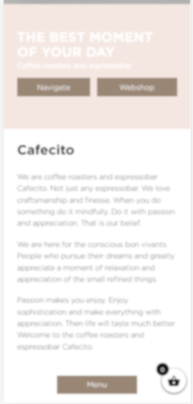
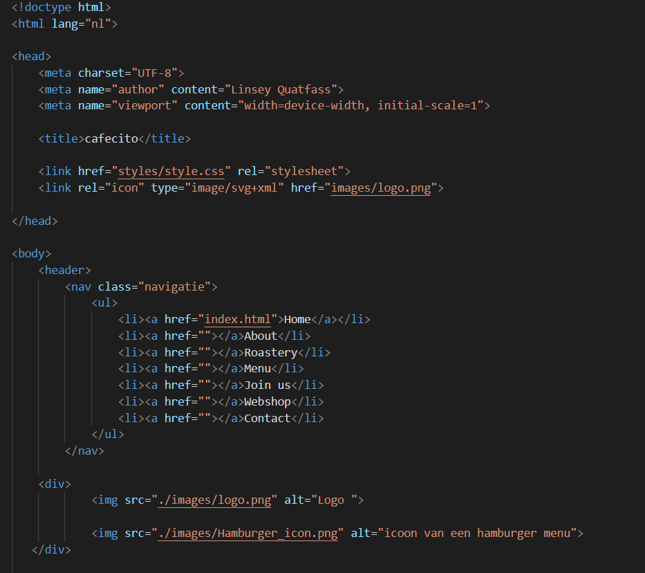
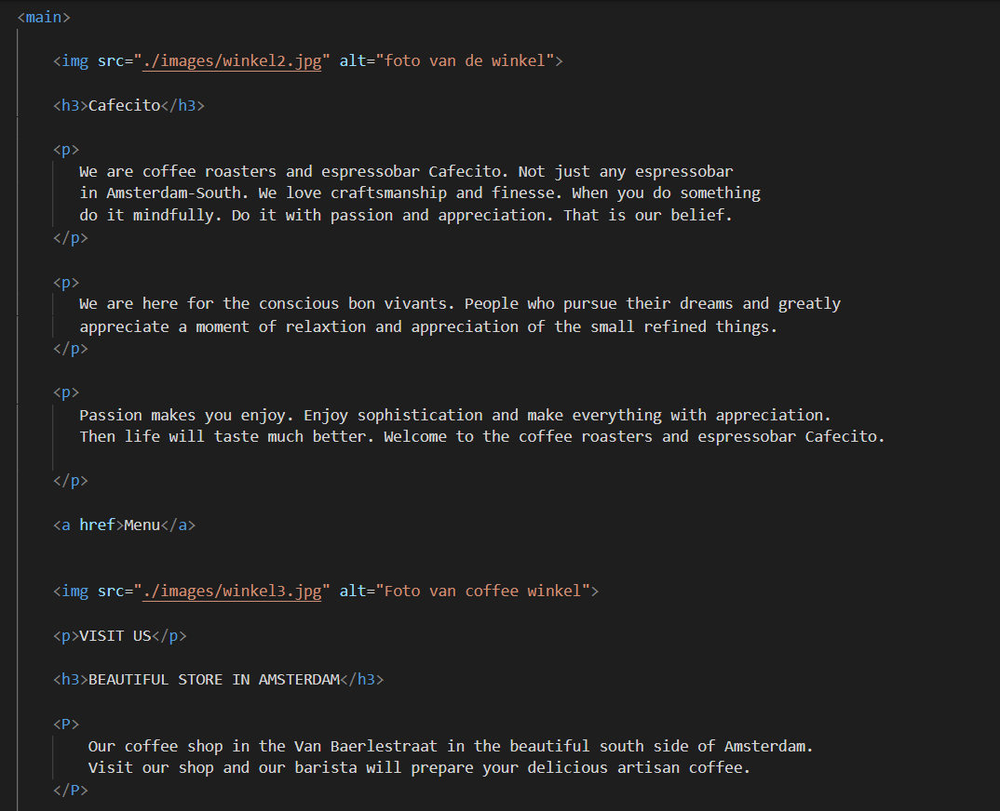
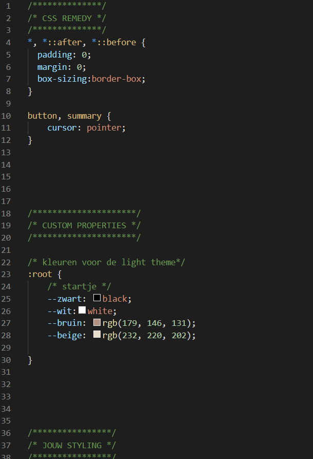
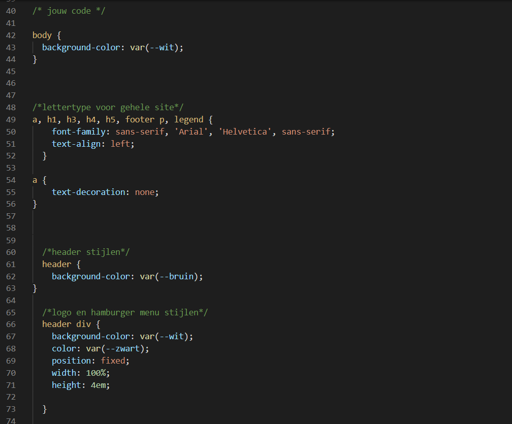
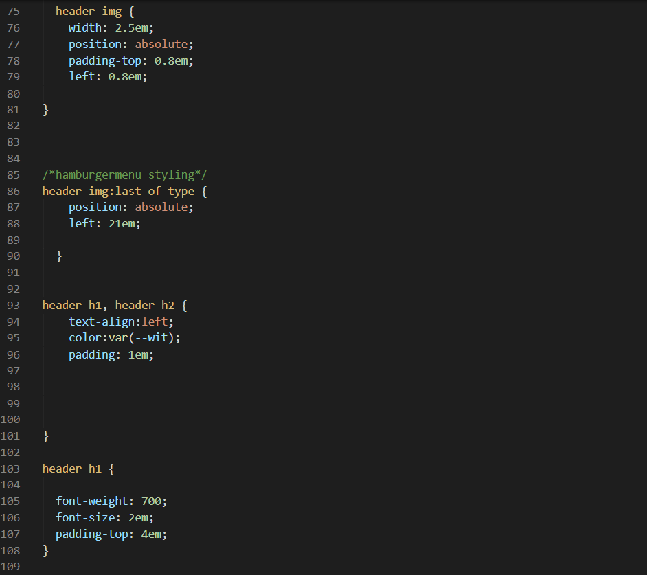
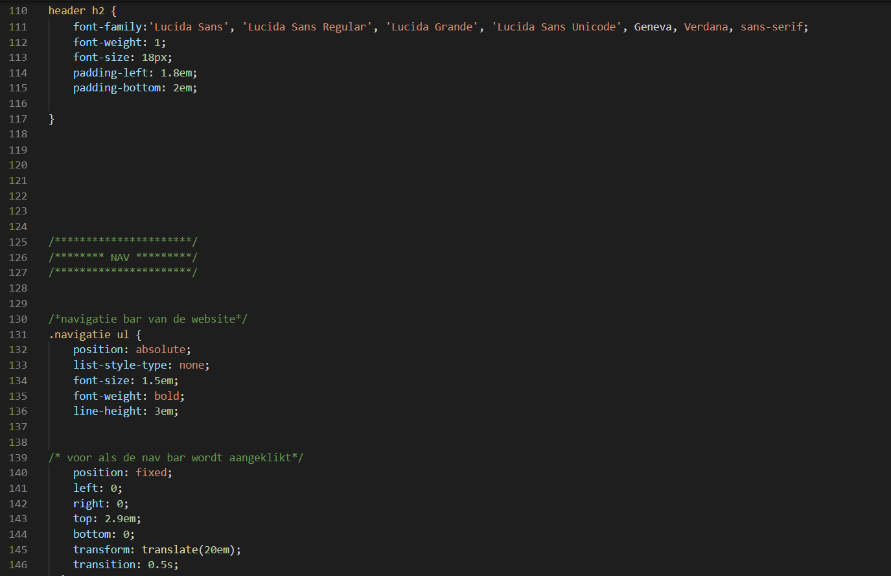
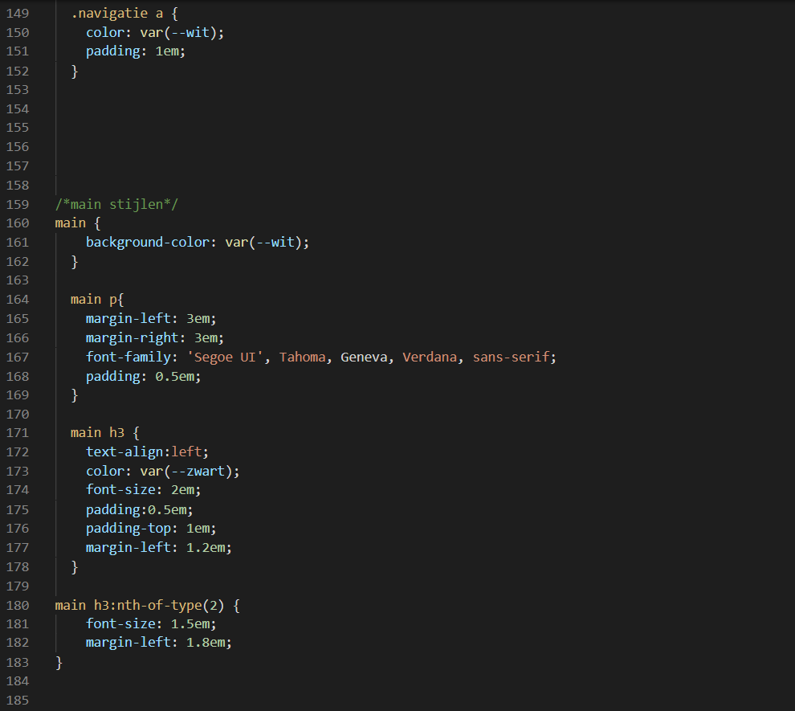
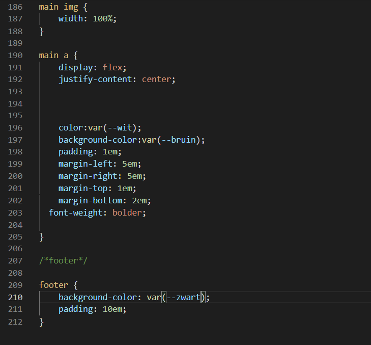

# Procesverslag
Markdown is een simpele manier om HTML te schrijven.  
Markdown cheat cheet: [Hulp bij het schrijven van Markdown](https://github.com/adam-p/markdown-here/wiki/Markdown-Cheatsheet).

Nb. De standaardstructuur en de spartaanse opmaak van de README.md zijn helemaal prima. Het gaat om de inhoud van je procesverslag. Besteedt de tijd voor pracht en praal aan je website.

Nb. Door *open* toe te voegen aan een *details* element kun je deze standaard open zetten. Fijn om dat steeds voor de relevante stuk(ken) te doen.

## Jij

  
INFORMATIE

  ### Auteur:
  Linsey Quatfass

  #### Je startniveau:
  Startniveau: BLAUW

  #### Je focus:
  Focus: surface plane
 

## Je website

  
Informatie over de gekozen website

  ### Je opdracht:
  Gekozen website is: Cafecito 
  Url van de website <a href="https://cafecito.nl/about-our-coffee/">Cafecito website</a>

  #### Screenshot(s) van de eerste pagina (small screen): 
  Home pagina

  

  

  #### Screenshot(s) van de tweede pagina (small screen):
  About page 

  
 

## Toegankelijkheidstest 1/2 (week 1)

  
uitwerken na test in 1e werkgroep

  ### Bevindingen
  Lijst met bevindingen website:

  website maakt niet gebruik van veel verschillende fonts.
  heeft een grote NAV bar, in de nav bar een optie om de taal te veranderen.
  Afbeeldingen verschijnen in beeld tijdens het scrollen.
  Scrol/caroucel bar met producten.
  Producten/afbeelding worden groter als je met de muis erover heen gaat.
  Producten die uitverkocht zijn worden aangegven door een doorzichtig vlak eroverheen. Wel nog klikbaar om product te bekijken.
  Nav bar komt vanaf rechts in beeld en neemt maar 20% in van het beeldscherm.
  Winkelmadje rechts onder blijft altijd in beeld staan bij acties. (zoals de nav bar aanklikken)
  De nav bar is geen vaste nav bar (dat ga ik wel doen)
  

  

  #### Screenreader
  Uit de test met de screenreader is uit gekomen dat hij bij het klikken op de website eerst een uitleg geeft over op wat voor website de gebruiker zich bevind.
  Bij het klikken op de button voor de 'transelate'geeft de website alleen aan dat het een button is. Verder geeft de screenreader extra uitleg bij producten en maakt er een soort verhaal van dat te volgen is. In de footer gaan wel een paar dingen mis. Hij spreekt hierbij niet alles uit wanneer er geklikt wordt op een uitklap button voor meer informatie. Verder is de screenreader al aardig netjes.

  #### Muis en Toetsenbord 
  Eerst begonne  we met het veranderen van de kleuren op de website. Alle kleuren bleven netjes en alles bleef goed leesbaar, de contrasten bleven duidelijk voor een website bezoeker. Bij de 'blurrvision' tool is alles niet meer goed leesbaar, maar het is niet onmogelijk.

  

  #### Motoriek (shocks, elastiekjes)
  Met de elastiekjes om twee vingers is het erg lastig om te scrollen het is nietmogelijk via het beeldscherm met de muispad. Wel kan het bij de scroll bar, aangezien klikken wel lukt. Zo lukte het ook om te klikken op buttons. De oefening met een ballon in 1 hand lukte de geene waarmee k de oefening deed niet goed, mij lukte het wel beter en merkte daardoor ook dat website niet erg chaotisch is waardoor ik ook ondertussen op de ballon kon letten en precies weer kon verder lezen vanaf waar ik gebleven was.

  Met het schock apperaat hebben wij niet gewerkt, omdat we het een beetje heftig vonden..

  #### Visueel (brillen, contrast, kleurenblind, dark/light). 
  wazige bril: NAV bar niet duidelijk zichtbaar, De 'p' is niet zichtbaar, De knoppen zijn zichtbaar, Boven titel van producten is zichtbaar, Contrasten zijn duidelijk, Footer is niet leesbaar.

  gele bril: Alles prima zichtbaar, geen hinderingen.

  tunnen vision bril:De tekst is niet te lezen.

  vlekkerig bril: Tekst valt te lezen maar is lastiger.

  Zwarte stip bril:Het is vervelend maar verder zijn acties mogelijk.

  Rechts geen zicht bril: De tekst is rechts niet zichtbaar dat hinderlijk is.

  

## Breakdownschets (week 1)

  
uitwerken na afloop 2e werkgroep

  ### de hele pagina: 
  

  ### dynamisch deel (bijv menu): 
  

  ### wellicht nog een dynamisch deel (bijv filter): 
  

## Voortgang 1 (week 2)

  
uitwerken voor 1e voortgang

  ### Stand van zaken
  Ik heb geen hinderingen gehad en met mijn code gaat het allemaal goed en ben ik goed op schema. Ik heb tot nu toe HTML en css code geschreven. 
  Verder had ik ook geen vragen, omdat ik lekker bezig met coderen en ook merk er meer plezier in te hebben dat de vorige keer. Dit omdat ik alles beter begrijp dan voorheen. Ik moet alleen mijn github op orde krijgen, dat is nog niet goed aangevuld.

   HTML code
  
  
  

  CSS code
  
  
  
  
  
  

  ### Agenda voor meeting
  samen met je groepje opstellen

  | student 1      | student 2          | student 3    | student 4        |
  | ---            | ---                | ---          | ---              |
  | dit bespreken  | en dit             | en ik dit    | en dan ik dat    |
  | en dat ook nog | dit als er tijd is | nog een punt | dit wil ik zeker |
  | ...            | ...                | ...          | ...              |

  ### Verslag van meeting
  hier na afloop snel de uitkomsten van de meeting vastleggen

  - punt 1
  - punt 2
  - nog een punt
  - ...

## Voortgang 2 (week 3)

  
uitwerken voor 2e voortgang

  ### Stand van zaken
  hier dit ging goed & dit was lastig (neem ook screenshots op van delen van je website en code)

  ### Agenda voor meeting
  samen met je groepje opstellen

  | student 1      | student 2          | student 3    | student 4        |
  | ---            | ---                | ---          | ---              |
  | dit bespreken  | en dit             | en ik dit    | en dan ik dat    |
  | en dat ook nog | dit als er tijd is | nog een punt | dit wil ik zeker |
  | ...            | ...                | ...          | ...              |

  ### Verslag van meeting
  hier na afloop snel de uitkomsten van de meeting vastleggen

  - punt 1
  - punt 2
  - nog een punt
- ...

## Toegankelijkheidstest 2/2 (week 4)

  
uitwerken na test in 8e werkgroep

  ### Bevindingen
  Lijst met je bevindingen die in de test naar voren kwamen (geef ook aan wat er verbeterd is):

  #### Screenreader
  Hier korte omschrijving (met indien nodig afbeeldingen)

  Hier een omschrijving van hoe het opgelost kan worden (met indien nodig afbeeldingen)

  #### Muis en Toetsenbord 
  Hier korte omschrijving (met indien nodig afbeeldingen)

  Hier een omschrijving van hoe het opgelost kan worden (met indien nodig afbeeldingen)

  #### Motoriek (shocks, elastiekjes)
  Hier korte omschrijving (met indien nodig afbeeldingen)

  Hier een omschrijving van hoe het opgelost kan worden (met indien nodig afbeeldingen)

  #### Visueel (brillen, contrast, kleurenblind, dark/light). 
  Hier korte omschrijving (met indien nodig afbeeldingen)

  Hier een omschrijving van hoe het opgelost kan worden (met indien nodig afbeeldingen)

## Voortgang 3 (week 4)

  
uitwerken voor 3e voortgang

  ### Stand van zaken
  hier dit ging goed & dit was lastig (neem ook screenshots op van delen van je website en code)

  ### Agenda voor meeting
  samen met je groepje opstellen

  | student 1      | student 2          | student 3    | student 4        |
  | ---            | ---                | ---          | ---              |
  | dit bespreken  | en dit             | en ik dit    | en dan ik dat    |
  | en dat ook nog | dit als er tijd is | nog een punt | dit wil ik zeker |
  | ...            | ...                | ...          | ...              |

  ### Verslag van meeting
  hier na afloop snel de uitkomsten van de meeting vastleggen

  - punt 1
  - punt 2
  - nog een punt
  - ...

## Eindgesprek (week 5)

  
uitwerken voor eindgesprek

  ### Je uitkomst - karakteristiek screenshots:
  

  ### Dit ging goed/Heb ik geleerd: 
  Korte omschrijving met plaatjes

  

  ### Dit was lastig/Is niet gelukt:
  Korte omschrijving met plaatjes

  

## Bronnenlijst

  
continu bijhouden terwijl je werkt

  Nb. Wees specifiek ('css-tricks' als bron is bijv. niet specifiek genoeg).

  1. bron 1
  2. bron 2
  3. ...

